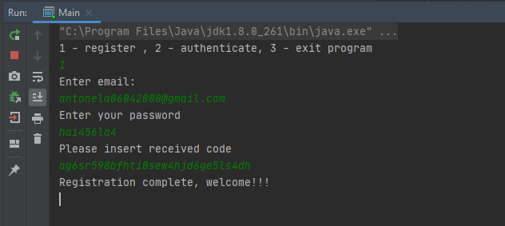
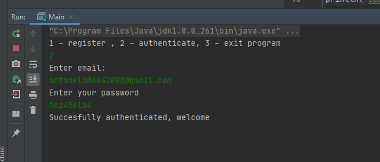
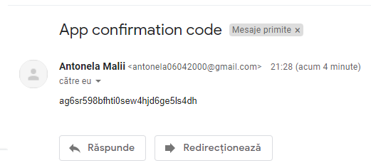

# Lab 8: Email Confirmation

## Table of contents
* [Laboratory Task](#lab-tasks)
* Results(#results)
* [Technologies](#technologies)

## Laboratory Task
Our  application must enable the user to:

* Create an application that could register a new user;

* Perform email confirmation (via a one time password / code or via a link);

* Output on the screen whether a user confirmed their email or did not confirm it yet.

## Results

### Technologies
1. MongoDB 
2. Java

